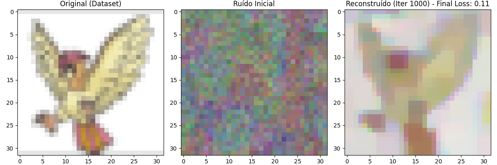

# BadPokedex: Federated Learning, DLG Attacks & Defense 🛡️👾

Este repositório implementa um sistema de **Federated Learning (Aprendizado Federado)** utilizando o framework **Flower (flwr)**, focado na classificação de imagens de Pokémon.

O objetivo principal deste projeto é acadêmico e de segurança: ele demonstra como gradientes compartilhados em redes federadas podem vazar dados sensíveis através de ataques **iDLG (Improved Deep Leakage from Gradients)** e implementa **Quantização de Gradientes** como mecanismo de defesa.

## 📸 Demonstração do Ataque

O ataque iDLG consegue reconstruir a imagem original de um cliente interceptando apenas os gradientes enviados ao servidor, sem acesso aos dados brutos.


*Esquerda: Imagem original do cliente (Pokémon). Direita: Imagem reconstruída pelo servidor malicioso a partir dos gradientes.*

## 🚀 Funcionalidades

* **Federated Learning com Flower:** Simulação de múltiplos clientes (treinamento distribuído) usando Ray e Flower.
* **Modelo Customizado:** Implementação de uma CNN baseada na **LeNet**, otimizada para imagens 32x32.
* **Ataque de Privacidade (iDLG):** Script capaz de reverter gradientes para recuperar a imagem de entrada (pixel-wise reconstruction).
* **Defesa (Quantização):** Implementação de `GradientQuantizer` para reduzir a precisão dos gradientes (ex: 8 bits), dificultando a reconstrução pelo atacante e economizando banda.
* **Dataset:** Suporte para carregamento de imagens via `ImageFolder` (Dataset de Pokémon).

## 📂 Estrutura do Projeto

```bash
BadPokedex/
├── fl_dlg_pokedex_DEFENSE.ipynb  # Notebook principal: Simulação FL + Defesa + Ataque
├── run.py                        # Script standalone para testar o ataque iDLG isoladamente
├── utils.py                      # Funções auxiliares (Dataset, Arquitetura LeNet, Utils de Imagem)
├── load.py                       # Scripts de carregamento e split de dados
├── Figure_1.png                  # Exemplo visual do resultado
└── README.md                     # Documentação do projeto